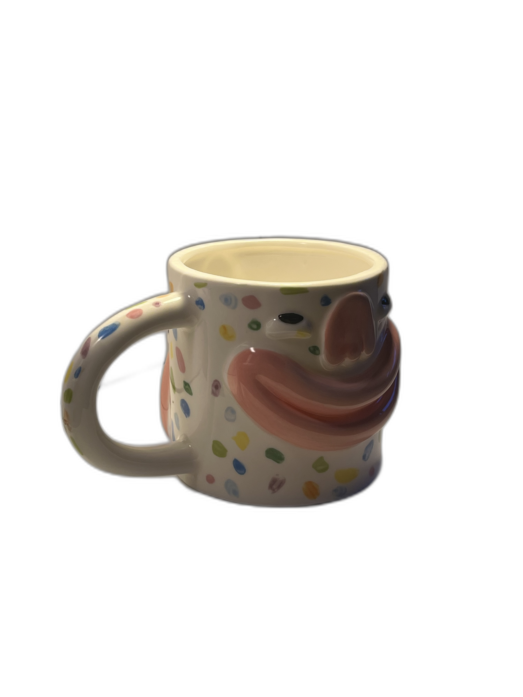
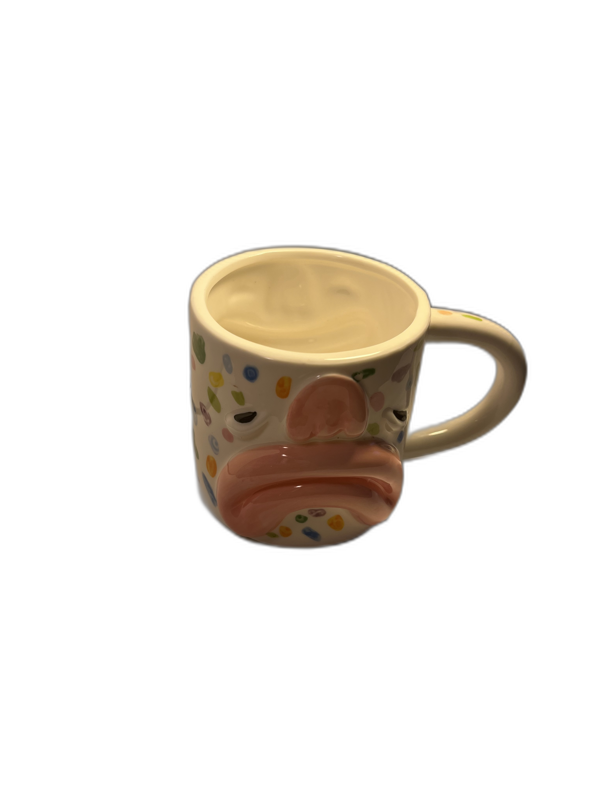
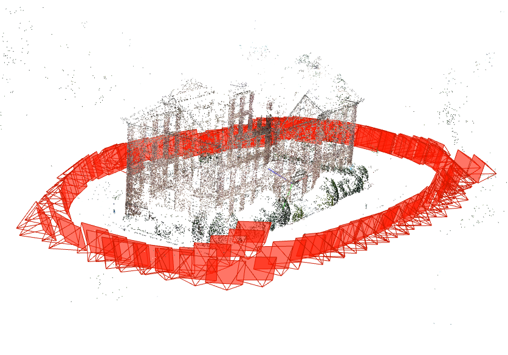
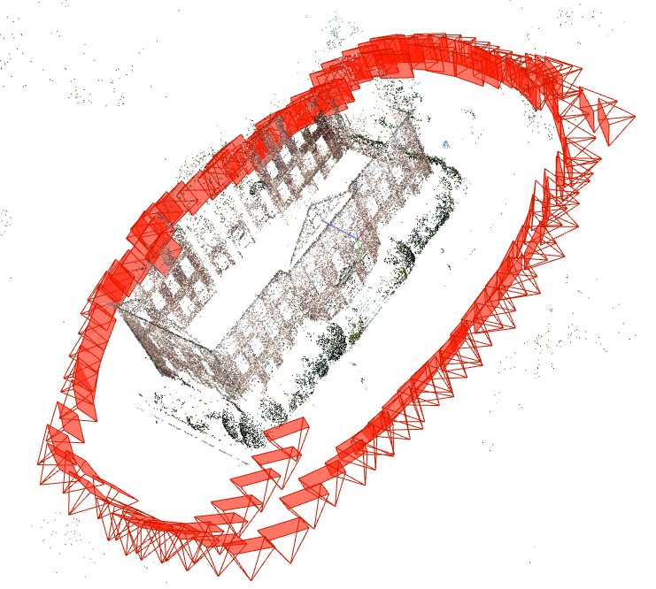

# ЛАБОРАТОРНАЯ 01

Что было сделано (чекай ./laba01/run.sh):

```
# 1. Feature extraction
colmap feature_extractor --database_path database.db --image_path <PATH_TO_IMAGES>

# 2. Feature matching
colmap exhaustive_matcher --database_path database.db

# 3. Sparse reconstruction
colmap mapper --database_path database.db --image_path <PATH_TO_IMAGES> --output_path sparse

# 4. Dense reconstruction (you need CUDA!)
colmap image_undistorter --image_path <PATH_TO_IMAGES> --input_path sparse/0 --output_path dense
colmap patch_match_stereo --workspace_path dense
colmap stereo_fusion --workspace_path dense --output_path dense/fused.ply
```

## 1. Исходные данные

- **Свой** (/src, без фона /cup-img): кружка с двумя узорами, SIMPLE_RADIAL iPhone 13, **53** фото




- **Эталон** (публичный тестовый South Building; доступен по ссылке https://demuc.de/colmap/datasets): здание с кустами, SIMPLE_RADIAL Canon Mark II, **128** фото


## 2. Обработка

- *Свой*: **21,418** фичей (**405** на изображение), **1378** матчей (гладкая текстура + блики + отдаление / приближение камеры). Подробнее в **/cup-img** !!!


- *Эталон*: **1,229,716** фичей (**9,607** на изображение), **498,573** матчей (эталон на то и есть эталон). Подробнее в **/south-building** !!!

## 3. Визуализация

- *Своё* болото (есть ручка; грустная морда отличается от весёлой):


- *Эталонная* конфетка (шедевр):





## 4. Выводы

1. South Building - качественный датасет для фотограмметрии с хорошей текстурой
   и достаточным перекрытием кадров.

2. Ключевым этапом является feature matching: для успешной реконструкции
   необходимо достаточное количество соответствий между изображениями.

3. Sparse reconstruction восстанавливает геометрию сцены и позиции камер,
   но не создаёт плотную поверхность.

4. Dense reconstruction требует значительных вычислительных ресурсов
   (GPU с CUDA) и времени, но создаёт детализированную 3D-модель. Из-за ограничений в условиях Сибири пока без 3D модельки.

5. Качество реконструкции напрямую зависит от:
   - Текстуры объекта/сцены
   - Перекрытия между кадрами (>60%)
   - Освещения и отсутствия бликов
   - Стабильности камеры при съёмке

# ЛАБОРАТОРНАЯ 02
